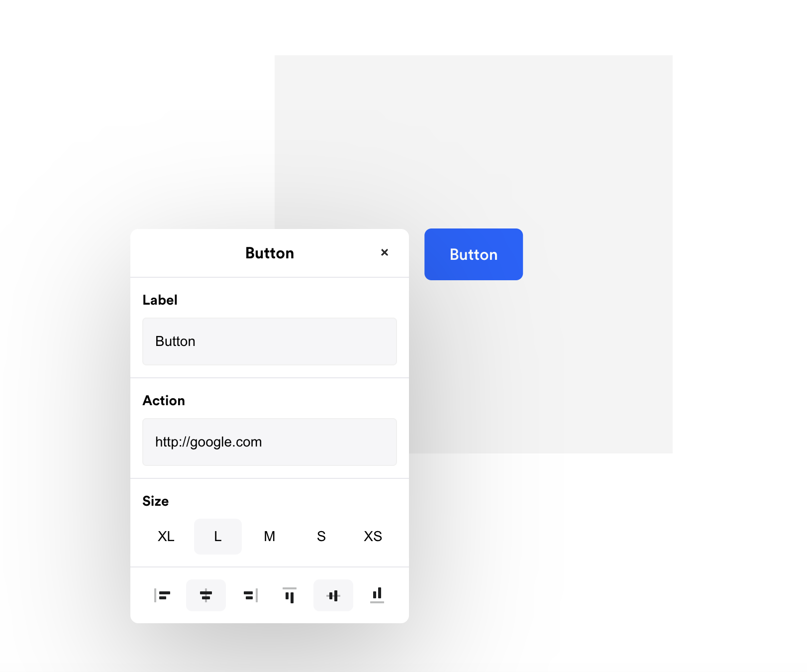

## Onepage Test Task

- [Task description](https://onepageio.notion.site/Onepage-Test-Task-80af81b394e843839b860ecae121b6f1#007c59ef82ca478b823931821da5c3c1)
- [Task designs](https://www.figma.com/file/y55sGKIFRTdINp3LgQMNrE/FE-engineer-%2F-Test?type=design&node-id=1-146&mode=design&t=kaGVZvfO2o9KetxS-0)

## How to run locally

This repostory is started with [Vite](https://vitejs.dev/).

To run locally you need to:

- install dependencies: `npm install`
- start local dev server: `npm run dev`
- open [http://localhost:5173](http://localhost:5173/)

## Preview

Open [live demo](https://65f8a238d9c7d417de5763a5--heroic-puppy-564fe6.netlify.app/) to preview results.

